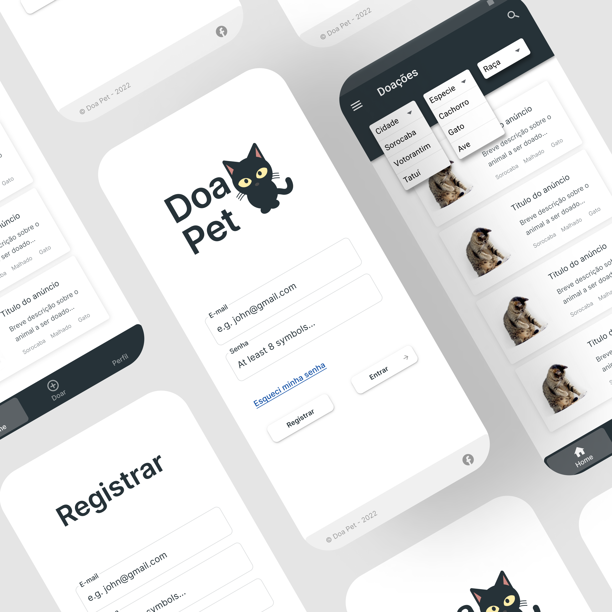

<h1 align="center">
  
</h1>
  

**Colaboradores**
- Gabriel Hammermeister Mena da Costa		**190162**  **CP110TIN2** **PA038TIN3**
- Leonardo Muhamed Batista					**190448**  **CP110TIN2** **PA038TIN3**
- Edgar Rosotti Navarro						**180669**  **CP110TIN2** **PA038TIN3**
- João Vitor Uchoas Santos					**190350**  **CP110TIN2** **PA038TIN3**
- Pedro Henrique França de Deus   **190418**  **Nenhuma** **PA038TIN3**

**Planejamentos e Objetivos**
- Modelagem das entidades
- Criação e estruturação do projeto Firebase
- Design da pagina inicial
- Criação do projeto ReactNative
- Instalação do firebase no projeto
- Criação e integração da tela de Login
- Criação da tela inicial

## Funcionalidades

- Login e criação de conta usando firebase
- Feed com fotos dos animais a serem doados
- Página de perfil do usuário
- Formulário para criação de post 

## Instalação

- Baixe e extraia o projeto em uma pasta de sua preferência
- Abra o terminal e navegue até a pasta do seu projeto
- Rode uma `yarn` ou `npm install` para instalar as dependências do projeto

### Expo CLI
- Após a instalação das dependências rode um `expo start` em seu terminal
- E rode em seu dispositivo físico usando o qrcode disponível, via cabo ou emulador digitando `a` no terminal

### React Native CLI
- Após a instalação das dependências rode um `yarn start` ou `npx react-native start`
- E depois rode um `yarn android` ou `npx react-native run-android` para abrir em seu dispositivo físico ou emulador

